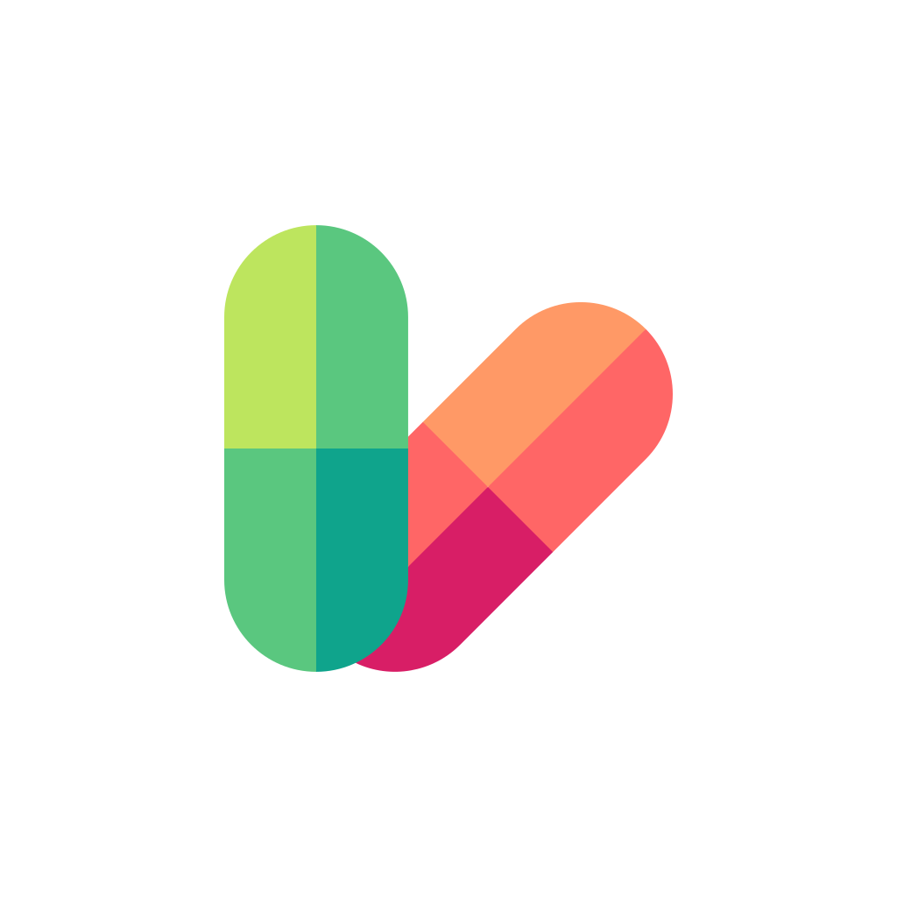
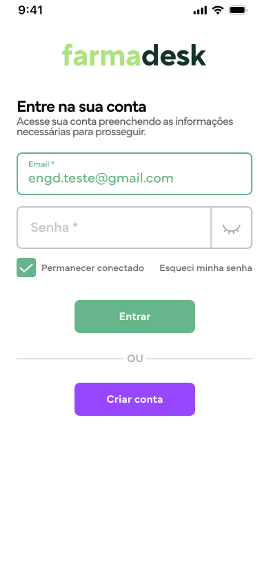
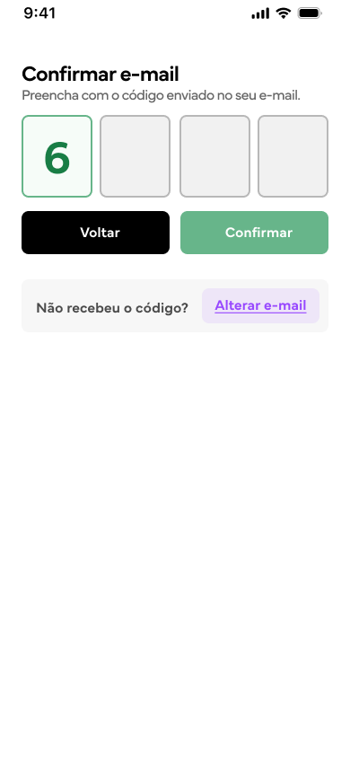
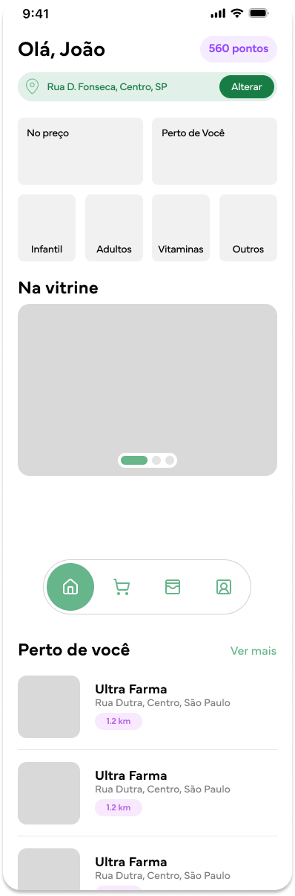
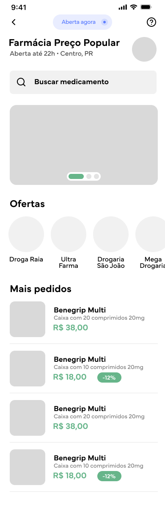
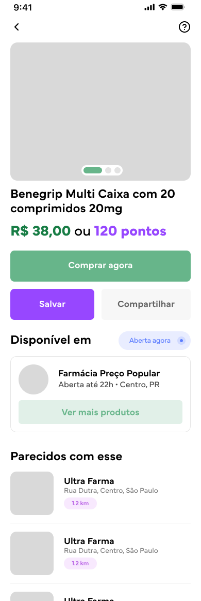
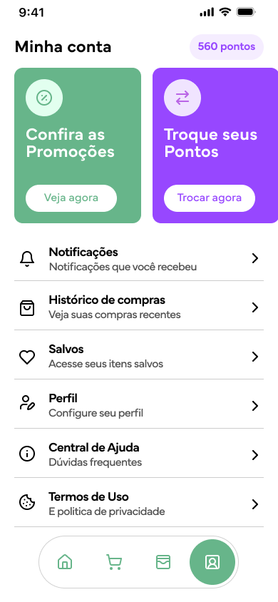
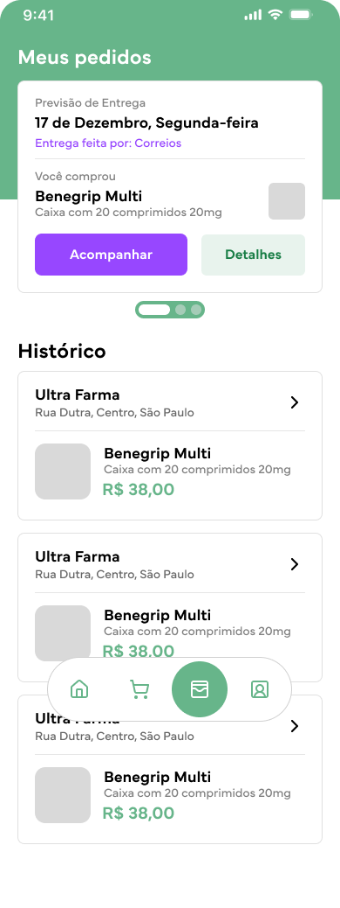
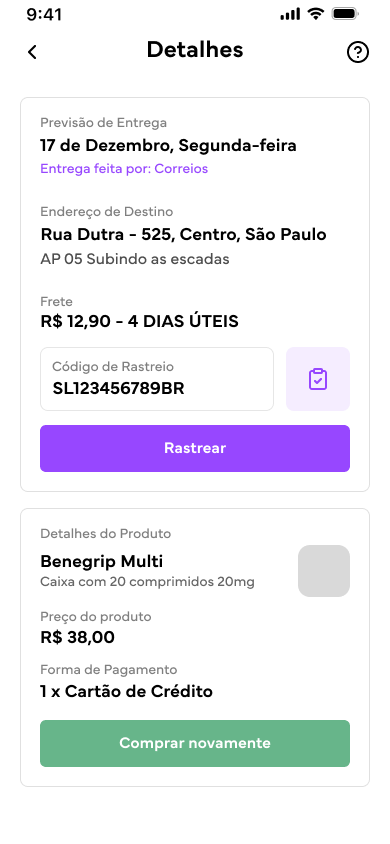
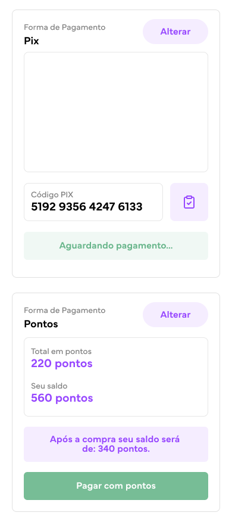

# Farma Desk

> Teste para vaga de desenvolvedor frontend na `Engenharia Digital`.

O aplicativo conta com algumas telas de exemplo de um aplicativo no ramo de farmácia, que são:

---
<br>
<div style="display: flex; align-items: center; justify-content: center; gap: 8px">
     
    <a style="font-style: italic; font-size: 20px" href="https://drive.google.com/file/d/1hhh7NC4lecXoD3agn0X8ovEWwKd_IZTy/view?usp=sharing">Farma Desk - Clique aqui para baixar o apk! [Android]<span>
</div>
<br>

---

<ol style="display: flex; flex-wrap: wrap; gap: 20px; list-style-position: inside; padding: 0;">
    <div style="display: flex;flex-direction: column;align-items: center;">
        <li>Login</li>
        
    </div>
    <div style="display: flex;flex-direction: column;align-items: center;">
        <li>Confirmar e-mail</li>
        
    </div>
    <div style="display: flex;flex-direction: column;align-items: center;">
        <li>Home</li>
        
    </div>
    <div style="display: flex;flex-direction: column;align-items: center;">
        <li>Loja</li>
        
    </div>
    <div style="display: flex;flex-direction: column;align-items: center;">
        <li>Produto</li>
        
    </div>
    <div style="display: flex;flex-direction: column;align-items: center;">
        <li>Conta</li>
        
    </div>
    <div style="display: flex;flex-direction: column;align-items: center;">
        <li>Meus pedidos</li>
        
    </div>
    <div style="display: flex;flex-direction: column;align-items: center;">
        <li>Detalhes - Acompanhar</li>
        
    </div>
    <div style="display: flex;flex-direction: column;align-items: center;">
        <li>Checkout</li>
        
    </div>
</ol>
<br>

## Clonar repositório

```Bash
git clone git@github.com:DevViniciusAmaral/farma-desk.git
```

## Variáveis de ambiente

```Bash
EXPO_PUBLIC_GOOGLE_API_KEY=""
EXPO_PUBLIC_GOOGLE_API_URL=""
```

## Instalar dependências

```Bash
yarn install || npm install
```

## Executar

```Bash
yarn android || npm run android
```
